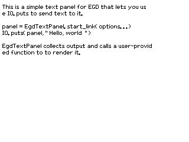

<!--
  SPDX-FileCopyrightText: 2026 Frank Hunleth
  SPDX-License-Identifier: CC-BY-4.0
-->

# EgdTextPanel

[](https://hex.pm/packages/egd_text_panel)
[](https://egd-text-panel.hexdocs.pm/EgdTextPanel.html)
[](https://dl.circleci.com/status-badge/redirect/gh/fhunleth/egd_text_panel/tree/main)
[](https://api.reuse.software/info/github.com/fhunleth/egd_text_panel)

This is a simple text panel for use with the [EGD (Erlang Graphics
Drawer)](https://github.com/erlang/egd) library.



This is being used to output text to an EInk display. EGD is not even close to
supporting the feature set of other graphics libraries, but it's pure Erlang.
It's also sufficient for lots of projects where I just want to show status or
output diagnostics.

## Example code

This code snippet works on the Nerves Starter Kit.

```elixir
defmodule Demo do
  @behaviour EgdTextPanel.Renderer

  def run() do
    {:ok, eink} =
      EInk.new(EInk.Driver.UC8179,
        dc_pin: "EPD_DC",
        reset_pin: "EPD_RESET",
        busy_pin: "EPD_BUSY",
        spi_device: "spidev0.0"
      )

    {:ok, panel} =
      EgdTextPanel.start_link(
        renderer: __MODULE__,
        renderer_state: %{eink: eink, render_count: 0},
        width: 648,
        height: 480,
      )

    IO.puts(panel, "Hello, world!")

    panel
  end

  @impl EgdTextPanel.Renderer
  def draw_background(_image, state), do: state

  @impl EgdTextPanel.Renderer
  def render_image(image, state) do
    # Do a full refresh every 10 frames
    render_count = state.render_count
    refresh_type = if rem(render_count, 10) == 0, do: :full, else: :partial

    rgb = :egd.render(image, :raw_bitmap)
    data = pack_bits(rgb)
    EInk.draw(eink, data, refresh_type: refresh_type)

    %{state | render_count: render_count + 1}
  end

  def pack_bits(binary) do
    # Convert 24-bit RGB to 1 bpp. This samples the high bit of the red
    # component. A more sophisticated conversion would convert to gray and
    # dither, but the example source image is black and white anyway.
    for <<b0::1, _::23, b1::1, _::23, b2::1, _::23, b3::1, _::23, b4::1, _::23, b5::1, _::23,
          b6::1, _::23, b7::1, _::23 <- binary>>,
        into: <<>> do
      <<b0::1, b1::1, b2::1, b3::1, b4::1, b5::1, b6::1, b7::1>>
    end
  end
```

## Fonts

EGD uses `.wingsfont` files. These appear to have originated with
[Wings 3D](https://www.wings3d.com/) even though it hasn't used them in a long
time. They're lightly processed BDF bitmap fonts that have been saved in Erlang
term format to make them easy to load.

At the moment, my [fork of EGD](https://github.com/fhunleth/egd/tree/fh-fixes)
has the `.bdf` to `.wingsfont` conversion utility that used to be in the Wings
3D repository. Also be aware that EGD doesn't support Unicode characters. It's
an easy fix that you can also find in my fork.

Before converting a BDF font, you may want to use [BDF
view](https://emurenmrz.github.io/bdf_view/) to view the glyphs.
